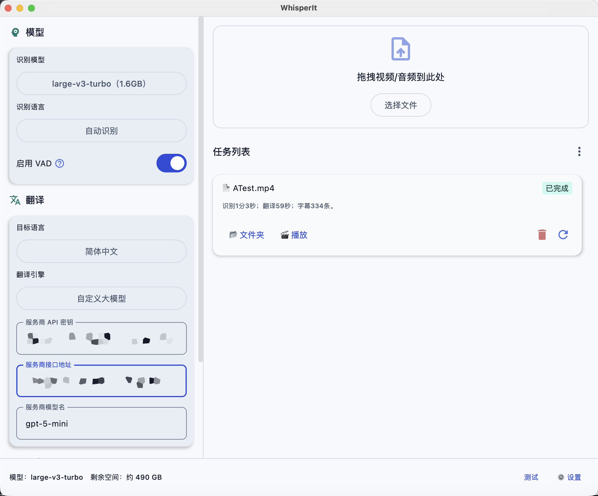

<p align="center">
  <strong>KaptionIt</strong>
</p>

<p align="center">
  <a href="#english">English</a> | <a href="#chinese">中文</a>
</p>

<p align="center">
  <a href="#english"></a>
</p>


---

<a name="english"></a>
## English

**KaptionIt** is a **desktop** app for **speech-to-text**, **translation**, and **bilingual subtitle export** (SRT, VTT, TXT). 

### Features

- **Transcription** powered by [whisper.cpp](https://github.com/ggml-org/whisper.cpp) (`whisper-cli`), with optional **VAD** for better segment boundaries  
- **Translation** via multiple engines: **Apple Translate** (macOS, on-device), **Google**, **DeepL**, and **OpenAI-compatible** custom LLM APIs  
- **Export**: subtitle format and content (original / translation / bilingual single or dual files)  

### Tech stack

- [Kotlin Multiplatform](https://kotlinlang.org/docs/multiplatform.html) & [Compose Multiplatform](https://www.jetbrains.com/compose-multiplatform/) (Desktop / JVM)  

### Requirements

- **JDK** compatible with this project (Gradle will use a toolchain if configured; use a recent LTS such as **17+**).  
- **macOS** (recommended for full features): Xcode / Command Line Tools for building bundled native tools; **Apple Translate** requires macOS and downloaded system translation languages.  
- **Windows / Linux**: project build scripts support bundling **whisper-cli** (Windows zip) and native helpers where applicable; see `composeApp/build.gradle.kts` for platform-specific tasks.  

### Build & run

```bash
./gradlew :composeApp:compileKotlinJvm   # compile check
./gradlew :composeApp:run                # run the desktop app
```

On Windows:

```bat
.\gradlew.bat :composeApp:run
```

### Packaging

Run the following to generate installers (**DMG / MSI / DEB**):

```bash
./gradlew :composeApp:packageDistributionForCurrentOS
```

> [!IMPORTANT]
> **JDK 17+ with `jpackage` is required.** The default Android Studio JBR may lack it. Set a full JDK (e.g., Temurin) in Gradle settings if needed.

### License

This project is licensed under [**CC BY-ND 4.0**](https://creativecommons.org/licenses/by-nd/4.0/) ( [`LICENSE`](./LICENSE) ).

- You may **view**, **clone**, and **redistribute unmodified** copies with attribution.  
- You may **not** distribute **modified** versions of this work (no forks that change the code and are published as derivatives under this license).  

---

<a name="chinese"></a>
## 中文

**KaptionIt** 是一款支持 **语音转文字**、**翻译** 以及 **双语字幕导出** (SRT, VTT, TXT) 的 **桌面端** 应用。

### 功能特点

- **转录**：基于 [whisper.cpp](https://github.com/ggml-org/whisper.cpp) (`whisper-cli`)，支持可选的 **VAD**（语音活动检测）以获得更好的断句效果。
- **翻译**：支持多种引擎：**Apple 翻译** (macOS 原生离线)、**Google**、**DeepL** 以及兼容 **OpenAI** 协议的自定义大模型 API。
- **导出**：支持多种字幕格式及内容选择（原文 / 译文 / 双语单文件或双文件）。

### 技术栈

- [Kotlin Multiplatform](https://kotlinlang.org/docs/multiplatform.html) & [Compose Multiplatform](https://www.jetbrains.com/compose-multiplatform/) (Desktop / JVM)

### 环境要求

- **JDK**：建议使用 **17+** 版本的 JDK（Gradle 将根据配置自动识别，建议使用最近的 LTS 版本）。
- **macOS**：推荐系统，支持完整功能。打包原生工具需安装 Xcode 或命令行工具；**Apple 翻译** 功能需要 macOS 系统支持并下载相应的语言包。
- **Windows / Linux**：构建脚本支持打包 **whisper-cli** 及相关辅助工具；详情请参阅 `composeApp/build.gradle.kts`。

### 运行与构建

```bash
./gradlew :composeApp:compileKotlinJvm   # 编译检查
./gradlew :composeApp:run                # 运行桌面应用
```

Windows 环境下：

```bat
.\gradlew.bat :composeApp:run
```

### 应用打包

执行以下命令生成对应系统的安装包（**DMG / MSI / DEB**）：

```bash
./gradlew :composeApp:packageDistributionForCurrentOS
```

> [!IMPORTANT]
> **需要包含 `jpackage` 的 JDK 17+**。Android Studio 自带的 JBR 可能不含该工具，如遇报错请在 Gradle 设置中切换至完整的 JDK（如 Temurin）。

### 开源许可

本项目采用 [**CC BY-ND 4.0**](https://creativecommons.org/licenses/by-nd/4.0/) 许可协议 ( [`LICENSE`](./LICENSE) )。

- 您可以 **阅读**、**克隆** 并在保持署名的前提下 **重新分发** 未经修改的副本。
- 您 **不得** 分发此作品的 **修改版本**（即不支持发布修改代码后的衍生版本）。
